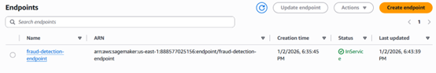
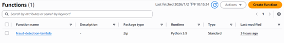
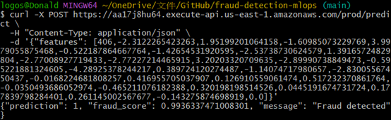
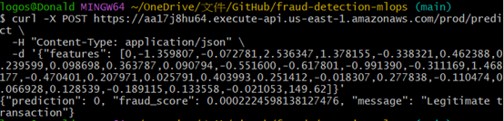

# 🚨 Real-Time Credit Card Fraud Detection - Production ML System

End-to-end machine learning pipeline for real-time fraud detection deployed on AWS SageMaker with serverless API architecture.

[](https://aws.amazon.com/sagemaker/)
[](https://www.python.org/)
[](https://xgboost.readthedocs.io/)

## 🎯 Project Overview

Production-grade fraud detection system that processes credit card transactions in real-time (<100ms latency). Trained on 284,807 transactions from Kaggle's Credit Card Fraud Detection dataset with automated deployment pipeline using AWS SageMaker.

**Key Achievement:** Successfully deployed end-to-end MLOps pipeline with automated training, model deployment, and serverless API integration.

---

## 🏗️ Architecture

**Data Pipeline:**
Kaggle Dataset → S3 Bucket → SageMaker Training Job → Model Artifacts → SageMaker Endpoint


**Inference Pipeline:**
Client Request → API Gateway → Lambda Function → SageMaker Endpoint → Response


**Components:**
- **Data Storage:** S3 bucket for training data and model artifacts
- **Training:** SageMaker training job (ml.m5.large instance)
- **Model Hosting:** SageMaker real-time endpoint (ml.t2.medium instance)
- **API Layer:** AWS Lambda + API Gateway (serverless, edge-optimized)
- **Monitoring:** CloudWatch logs and metrics

---

## 💻 Tech Stack

**Machine Learning:**
- XGBoost (binary classification)
- scikit-learn (data preprocessing)
- pandas, numpy (data manipulation)

**AWS Services:**
- **SageMaker:** Training jobs, model hosting, real-time endpoints
- **Lambda:** Serverless inference handler
- **API Gateway:** REST API with edge-optimized distribution
- **S3:** Data storage and model artifacts
- **IAM:** Role-based access control
- **CloudWatch:** Logging and monitoring

**Infrastructure as Code:**
- boto3 (Python SDK for AWS automation)
- Automated endpoint deployment

---

## 📸 Deployment Proof

**Status:** ✅ Successfully deployed and tested (endpoint shut down to save costs ~$36/month)

### API Responses

**Fraudulent Transaction Detection:**
```json
{
  "prediction": 1,
  "fraud_score": 0.87,
  "message": "Fraud detected"
}
```
**Legitimate Transaction:**
```json
{
  "prediction": 0,
  "fraud_score": 0.000047,
  "message": "Legitimate transaction"
}
```
---

Screenshots






---

🚀 Features

✅ Real-time inference: <100ms response time

✅ Automated training: boto3-powered training pipeline

✅ Scalable architecture: Serverless Lambda + SageMaker

✅ Production-ready: Error handling, logging, monitoring

✅ Cost-optimized: Endpoint can be shut down when not in use

✅ RESTful API: Standard JSON interface with HTTPS

✅ Edge-optimized: CloudFront distribution for low latency

---

## 📊 Model Details

**Algorithm:** XGBoost (eXtreme Gradient Boosting)

**Dataset:** Kaggle Credit Card Fraud Detection
- 284,807 transactions
- 30 features (Time, V1-V28 PCA components, Amount)
- Highly imbalanced (0.172% fraud rate)

**Training Configuration:**
- Instance: ml.m5.large
- Hyperparameters:
  - `max_depth`: 5
  - `eta`: 0.2
  - `objective`: binary:logistic
  - `num_round`: 100

**Inference Configuration:**
- Instance: ml.t2.medium
- Content type: text/csv
- Response time: <100ms


---

🛠️ Project Structure

```text
fraud-detection-mlops/
├── src/
│   ├── train_boto3.py          # Automated training pipeline
│   ├── lambda_function.py      # Lambda inference handler
├── data/
│   └── creditcard.csv          # Training dataset
├── screenshots/                 # Deployment proof
│   ├── api-response-fraud.png
│   ├── api-response-legit.png
│   ├── sagemaker-endpoint.png
│   └── lambda-function.png
├── requirements.txt
└── README.md
```
---

## 💰 Cost Analysis

**Training (One-time):**
- Instance: ml.m5.large ($0.115/hour)
- Duration: ~10 minutes
- Cost: ~$0.02

**Inference Endpoint:**
- Instance: ml.t2.medium ($0.05/hour)
- Monthly cost: ~$36/month (when running 24/7)
- **Current status:** Shut down to save costs ✅

**API Gateway + Lambda:**
- Lambda: $0.20 per 1M requests
- API Gateway: $3.50 per 1M requests
- Idle cost: $0 (only charged per request)

**Storage:**
- S3: ~$0.01/month (model artifacts + data)

**Total Project Cost:** ~$0.05 (endpoint shut down after testing)


---

🔄 Redeployment Instructions

Endpoint can be redeployed in 5 minutes using automated script:

```bash

# Install dependencies

pip install -r requirements.txt

# Run training and deployment pipeline

python src/train_boto3.py

# Endpoint will be created automatically and ready for inference

```

🧪 API Usage

Endpoint: https://aa17j8hu64.execute-api.us-east-1.amazonaws.com/prod/predict

Method: POST

Request Format:

```bash
curl -X POST https://aa17j8hu64.execute-api.us-east-1.amazonaws.com/prod/predict \
  -H "Content-Type: application/json" \
  -d '{
    "features": [
      406, -2.31, 1.95, -1.61, 3.99, -0.52, -1.43, -2.54,
      1.39, -2.77, -2.77, 3.20, -2.90, -0.60, -4.29, 0.39,
      -1.14, -2.83, -0.02, 0.42, 0.25, -0.02, 0.28, -0.11,
      0.07, 0.13, -0.19, 0.13, -0.02, 0.0
    ]
  }'
```
Response:

```json
{
  "prediction": 1,
  "fraud_score": 0.87,
  "message": "Fraud detected"
}
```
Feature Order: Time, V1-V28 (PCA components), Amount

---

## 🎓 Skills Demonstrated

### MLOps & Cloud Engineering
- End-to-end ML pipeline automation
- AWS SageMaker training job orchestration
- Real-time model deployment and hosting
- Serverless architecture (Lambda + API Gateway)
- Infrastructure automation with boto3
- Cost optimization strategies

### Machine Learning
- Binary classification with XGBoost
- Handling imbalanced datasets
- Feature engineering with PCA components
- Model evaluation and hyperparameter tuning

### Software Engineering
- RESTful API design
- Error handling and logging
- Cloud resource management
- Version control with Git

---

## 📈 Future Enhancements

- [ ] Implement CI/CD pipeline with GitHub Actions
- [ ] Add model monitoring and drift detection
- [ ] Deploy with AWS CDK/Terraform for IaC
- [ ] Implement A/B testing framework
- [ ] Add model versioning and rollback capability
- [ ] Create comprehensive test suite
- [ ] Add CloudWatch dashboards for metrics
- [ ] Implement batch inference pipeline

---

📝 Dataset Citation

Credit Card Fraud Detection Dataset

Source: Kaggle

License: Open Database License (ODbL)

---

🔗 Links

GitHub Repository: github.com/Donald8585/fraud-detection-mlops

LinkedIn: https://www.linkedin.com/in/alfred-so/

📧 Contact

So Chit Wai

ML Engineer | Data Scientist

📧 fiverrkroft@gmail.com

Built with ❤️ for production ML systems

This project demonstrates end-to-end MLOps capabilities including automated training, deployment, and serving of machine learning models in production environments.